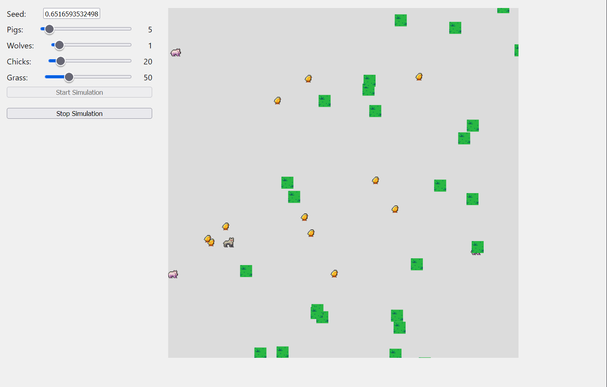

# Ecosystem Simulation

## Science Lens & Concept

This simulation models several real-world ecological phenomena:

1. **Trophic Levels**: It demonstrates a food web with three trophic levels:
    - **Producers**: Grass
    - **Primary Consumers**: Chicks (herbivores)
    - **Mesopredators**: Pigs (omnivores)
    - **Apex Predators**: Wolves (carnivores)
2. **Animal Behavior**: Entities have differing behaviors based on their roles and energy levels:
    - **Hunting**: Actively pursuing prey
    - **Fleeing**: Evading predators
    - **Grazing**: Consuming vegetation
    - **Wandering**: Moving randomly when not hunting or grazing

## Design Documentation

### Planning Process

The simulation utilized an Entity Component System (ECS) architecture to manage the complexity of interactions between
different entities in the ecosystem.
This allows for modular design compared to traditional OOP, where inheritance can prohibit easy extension of the
simulation.
The ECS architecture consists of three main parts:

1. **Entities**: The different animals and plants in the ecosystem
2. **Components**: Properties like Position, Velocity, Energy, etc. that define the state of each entity
3. **Systems**: Logic that processes entities with specific components (Movement, Hunting, Fleeing, etc.)

### Class Structure

- Builders for each entity type (e.g., `PreyBuilder`, `PredatorBuilder`, `MesopredatorBuilder`) with specific
  components (e.g., `Position`, `Velocity`, `Energy`, `HuntingRange`, etc.)
- Systems to handle entity behaviors:
    - `MovementSystem`: Updates entity positions based on velocity
    - `HuntingSystem`: Determines targets for predators
    - `FleeingSystem`: Calculates escape routes for prey
    - `GrazingSystem`: Manages grazing behavior for herbivores
    - etc.
- Main simulation loop that initializes entities, processes systems, control start/stop

### Key Hierarchies:

1. **Animal Hierarchy**:
    - PreyBuilder (base for animals that can be hunted)
        - Chick (pure prey, eats only vegetation)
    - PredatorBuilder (base for animals that hunt)
        - Wolf (apex predator)
    - MesopredatorBuilder (both predator and prey)
        - Pig (mid-level predator)

2. **Entity Relationships**:
    - Wolves hunt Pigs and Chicks
    - Pigs hunt Chicks
    - Chicks eat Grass
    - All entities lose energy when moving

## Implementation Overview

### How It Works

1. **Initialization**:
    - User sets initial population counts and random seed
    - World is populated with entities at random positions

2. **Simulation Loop**:
    - Systems execute in defined order each frame
    - Movement is calculated based on targets and energy levels
    - Hunting, fleeing, and grazing behaviors determine entity targets
    - Entities with depleted energy are removed
    - Camera allows user to zoom and pan to observe the simulation

3. **Entity Lifecycle**:
    - Entities wander when fully energized
    - When energy decreases, they seek food sources
    - If threatened by predators, prey entities prioritize fleeing
    - Successful hunting/grazing replenishes energy
    - Entities die when energy is depleted

### Features

- **Food web** with three trophic levels with easy extension for more
- **Energy ecosystem** where entities must hunt/graze to survive
- **Configurable initial conditions** via UI controls
- **Deterministic randomness** via seeded RNG for reproducible simulations

### User Controls

#### UI Controls:

- **Seed**: Enter a value to make simulation results reproducible
- **Pigs slider**: Set initial number of mesopredators (0-100)
- **Wolves slider**: Set initial number of apex predators (0-20)
- **Chicks slider**: Set initial number of primary consumers (0-200)
- **Grass slider**: Set initial number of producers (0-200)
- **Start Simulation button**: Initialize and begin the simulation
- **Stop Simulation button**: Pause the simulation

#### Mouse Controls:

- **Scroll wheel**: Zoom in/out
- **Left-click drag**: Pan camera

## Extensions & Creative Features

1. **Mesopredator Dynamics**: The inclusion of mid-level predators creates more complex food web relationships than
   simple predator-prey models.

2. **Energy System**: Entities have variable energy consumption rates based on their position in the food chain, making
   the simulation more realistic.

3. **Spatial Awareness**: Entities have different detection ranges, with apex predators having the largest hunting
   ranges and prey having smaller grazing ranges.

4. **Camera Controls**: Interactive zoom and pan functionality allows users to observe different parts of the ecosystem.

5. **Seeded Randomness**: The ability to set seeds allows for reproducible simulations, which is useful for scientific
   comparison.

## Screenshots and Demo


*Main interface*

[Watch the Ecosystem Simulation Demo](https://youtu.be/facLS1uQgPQ)

## Reflections

### Weekly Reflections

#### Week 1: Planning

- I implemented an Entity Component System architecture
  to achieve easy composition, allowing entities like Pigs to have both predator and prey behaviors without complex
  inheritance.

- At the start, I had problems with the hunting and fleeing behaviors, specifically on making it reusable across
  different entity types.

- I used iterative testing and observation, choosing whatever value that makes the most sense.

#### Week 2: Features & Interactivity

- I have created specialized systems within the ECS framework for food web dynamics, animal behaviors, UI controls, and
  camera functionality.

- The systems approach provided clean separation of code and data, allowing easy extension for future features like
  reproduction or environmental effects.

#### Week 3: Polish & Documentation

- Reusability and modularity of my code as I think it was structured quite nicely.

- I would add reproduction mechanics, environmental factors (e.g., seasons, day/night cycles), herding behaviour.

- Complex, realistic behaviors can emerge from simple rules with small random variations.

### Main Reflections

#### Physics Understanding

- The simulation demonstrates the interactions between different trophic levels of a food chain.
- It models how energy flows through an ecosystem.
- It implements hunting and fleeing behaviors, which are essential for understanding predator-prey dynamics.
- The food chain is quite simplified as it only include 4 entity types, but can be easily extended.

#### Implementation Challenges

- The main challenge was porting code from a traditional OOP structure to an Entity Component System (ECS) architecture.
- This change required rethinking how entities interact and how behaviors are implemented.
- I had to ensure that the ECS design allowed for easy extension and modification of entity behaviors without tightly
  coupling them.

#### Performance Optimization

- I opted for a simplified velocity-based movement system to reduce complexity compared to Newtonian physics.
- This approach allows for efficient updates of entity positions without the overhead of full physics simulations &
  allows for more clarity in demos.
- Furthermore, I deleted entities with zero energy to prevent unnecessary processing of inactive entities.

#### Creative Extensions

- I added a mesopredator level to the food web, which can hunt and flee at the same time
- I implemented a grazing behavior for herbivores, allowing them to consume vegetation and replenish energy.
- I added a camera system that allows users to zoom and pan around the simulation, enhancing interactivity.
- I used a seeded random number generator to ensure reproducibility of simulation results.

#### Science Communication

- The simulation effectively communicates ecological concepts like trophic levels, energy flow, and predator-prey
  dynamics.
- I can further improve the simulation by adding more environmental factors, such as seasonal changes or weather
  effects, to enhance realism.
- I can also allow the entities to communicate with each other, such as warning calls from prey or pack hunting
  strategies from predators.

## Source code

[GitHub Repository](https://github.com/netsbot/cepwa2.git)

[Game link](https://netsbot.github.io/cepwa2/)

For local development:

```
git clone https://github.com/netsbot/cepwa2.git
cd cepwa2
npm install
npm run dev
```

Visit `http://localhost:5173` in your browser to view the simulation.

## Acknowledgements

- [TypeScript](https://www.typescriptlang.org/)
- [BECSY](https://github.com/LastOliveGames/becsy) (Entity Component System)
- [P5.js](https://p5js.org/) (Rendering)
- [Vite](https://vite.dev/) (Build tool)
- [Mulberry32](https://gist.github.com/avilde/3736a903560b35fd587d213a3f79fad7) (RNG)
- [Grass sprites](https://ninjikin.itch.io/grass)
- [Animal sprites](https://deepdivegamestudio.itch.io/animalassetpack)
- [GitHub Copilot](https://github.com/features/copilot) (Documentation and code comments)
